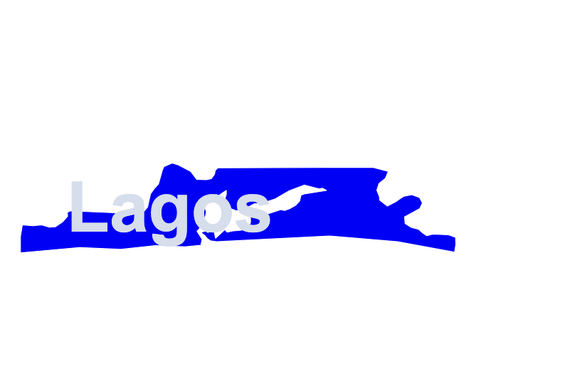

## nigerianstates-map 

This is a React Map library for Nigerian States


## Intro

This React library provides a visualization to various individual States in the Country of Nigeria

### Note
You can check the src/examples from the project directory for assistance.

### Install
```
npm install --save nigerianstates-map
```
```
yarn add nigerianstates-map
```




### Sample Usage

```javascript

import React from "react";
import {Lagos, Kaduna, Nigeria, State} from 'nigerianstates-map'; 

/**
 * You can import any state you need.
 * Or Import Nigeria and specify the state name.
 */

class App extends React.Component {
  
  render() {
    /**
    * You can import any state you need.
    */
    
    /**
    * @param hoverColor=>string color to be used when the map is hovered on.
    * @param defaultColor=> the default color for the map
    * @param id=> A unique id for the map 
    */
    return(
      <div>
        <Nigeria
          stateName={State.LAGOS}
          hoverColor="purple"
          defaultColor="blue"
          id="lagos"
        />
        <Kaduna
        />
        <Lagos
          hoverColor="purple"
          defaultColor="blue"
          id="lagos"
        />
     
    </div>

    );
  }
}

ReactDOM.render(<App />, document.querySelector("#root"));
```

## Unit Test
To run the tests, run `npm run test`.

See the test files in `src/lib/tests` for an example of a component test.


## Contributing
1. Create your feature branch: `git checkout -b feature-name`
2. Commit your changes: `git commit -m 'Some commit message'`
3. Push to the branch: `git push origin feature-name`
4. Submit a pull request 😉😎

## How can I thank you?

Why not star the github repo? Share to Others too.


